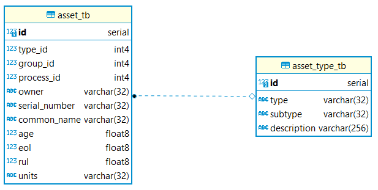

# data_management_framework

This is a repository for the Data Management Framework - a generic, flexible, and extensible framework to build data-driven prognostics applications off of. <discuss prognostics>

## Setup steps 
1. clone the repository  `git clone https://github.com/darrahts/data_management_framework.git`  
2. make [setup_database.sh](https://github.com/darrahts/data_management_framework/blob/main/setup_database.sh) executable and run it to setup the database and core tables `cd data_management_framework && chmod +x setup_database.sh`  
3. [optional] create a conda environment `conda create --name=datasci python=3.8 pandas jupyterlab scikit-learn psycopg2 seaborn tqdm pyarrow`

## The Framework
<div style="text-align: justify">The framework is centered around abstracting the key features of all components, degradation,  or any other physical or non-physical "tangible" that generates data into _assets_ and _processes_. This decouples the implementation of specific component or degradation models from the way they are composed at the system level, as well as how they interact with processes and generate data. The framework was initially conceived to facilitate data generation simulation experiments where the primary challenges consisted of 

- Requiring significant code changes when experimenting with different component or degradation models
- Difficulty in linking generated data to a set of specific models and operating conditions
- Difficulty in organizing the generated data in a manner that can be accessed from multiple dimensions (i.e. by component, time, operating conditions, etc)

This framework can be used with  

- simulations
- real systems
- existing datasets

Moreover, the framework can be used with any number of systems and system types, components and component types, or processes and process types. This framework is a key driver in implementing data-driven maintenance and operation scheduling, which is a challenge that many organizations continue to face. The framework is also highly extensible, able to meet a wide variety of specific use cases, some of which are discussed in the [Examples](#examples) section.

</div>


### Assets & Asset Types
<div style="text-align: justify"> Assets and asset-types are at the center of the framework. Every physical "tangible" is an asset, and every asset has an asset-type. There can only be one instance of a given asset-type, however there can be any number of assets of an asset-type. As an example with a UAV system, there is only one type allowed for <i>motor_threephase</i>, but there can be multiple three-phase motors modelled, either with the same or different parameters, or any combination. 

<p align="center">

</p>

The Tarot T18 and DJI S1000 both have 8 three phase motors, but the parameters for both are different. The Tarot T18 and DJI S1000 are systems comprised of multiple components, and they themselves are also different assets with the same asset-type (<i>uav_octorotor</i>). This is where flexibility meets simplicity, and this type of organization in conjunction with key constraints suit a wide variety of applications. 


### Processes & Process Types
Processes and process-types are analogous to assets and asset-types, however they are for non-physical "tangibles" that affect the system, components, and system operation. These can be <i>internal</i> processes like degradation, or <i>external</i> processes like wind. 

<p align="center">

</p>
Similar to assets and asset-types, there can only be one instance of a process-type, but multiple instances of that process. For example, there is only allowed to be one instance of <i>battery_charge_degradation</i>, but there can be multiple instances of this process, with any number of them having different parameters representing different degradation models for the same degradation type. 

### Data
All assets and processes generate data, and this data is linked to the assets, processes, and <i>group</i> from which it was generated. The group is not required, but it organizes assets across another dimension (discussed in greater detail in the [Examples](#examples) section. 

<p align="center">

</p>

Every generated data is also associated with a cycle, which takes on different meaning depending on the application. Application-specific data fields must be supplied by the user. 


### Examples  
1. <div style="text-align: justify"> The first example is a generic implementation of a single cyber physical system that is comprised of multiple components. The Entity-Relationship (ER) diagram is shown on the left and depicts the "under the hood" organization of the system and components. This type of diagram is a useful abstraction of the System Composition (SC) diagram, shown on the right. The SC diagram shows us how many systems and components we have and how the individual components relate to the system. In this example, there are two systems, each unique, comprised of several components, also unique. The same component cannot be used on more than one system, but any number of components, component-types, systems, system-types can be modelled.</div>

<p align="center">

</p>

2. The next example shows the framework implemented with a simulated UAV system for data collection. The UAV is the system and all UAVs are stored in the *uav_tb*. The UAV is comprised of motors, a battery, and an airframe. Just as above, there can be any number of UAVs, motors, batteries, or airframes, and they can all have different parameters even. Running experiments with different combinations of components only requires changing the asset id of that component on the UAV. Then, any data generated will correctly link to the newly changed component. 

<p align="center">

</p>

Component degradation and wind effects are also modeled and implemented as depicted in the SC diagram below. First, the process types are defined:  

- <i>charge_degradation</i>  
- <i>capacitance_degradation</i>  
- <i>motor_degradation</i>
- <i>wind_gusts</i>

Then the process models are defined and attached to the assets they affect. The degradation models are shown below, and it can be seen that there is a different degradation profile for each motor, however each profile is derived from the same underlying model. This is to correctly capture variations in usage-based degradation. 

<p align="center">

</p>


3. Data organization with the N-CMAPSS dataset
4. Data organization with electronics data

### API Usage


## References
[A Data Management Framework & UAV Simulation Testbed for theStudy of System-level Prognostics Technologies](https://www.researchgate.net/publication/356517965_Data_Management_Framework_UAV_Simulation_Testbed_for_the_Study_of_System-level_Prognostics_Technologies)

[A Data-Centric Approach to the Study of System-Level Prognostics for Cyber Physical Systems: Application to Safe UAV Operations](https://www.researchgate.net/publication/361487074_A_Data-Centric_Approach_to_the_Study_of_System-Level_Prog-_nostics_for_Cyber_Physical_Systems_Application_to_Safe_UAV_Operations)

[Developing Deep Learning Models for System Remaining Useful Life Predictions: Application to Aircraft Engines](https://www.researchgate.net/publication/361487238_Developing_Deep_Learning_Models_for_System_Remaining_Useful_Life_Predictions_Application_to_Aircraft_Engines)


<!--
- [Database schema](#database-schema) intended for a PostgreSQL DBMS
- [Python API](#python-api) to query the database
- [Data exploration and analysis](#data-exploration-and-analysis) notebooks
- [References](#references)
- (more to follow...)

The [Home Mortgage Disclosure Act data (HMDA)](#home-mortgage-disclosure-act-data) ~~is currently the only data available for use. Other data sources will be listed and described as they are made available.~~ provides data on loan applications and contains approximately 25M records per year.  

The [American Community Survey data (ACS)](#american-community-survey-data) provides data on race, age, sex, and population at the census tract level.

The [Zillow Home Value Index (ZHVI)](#zillow-home-value-index-data) provides median home values by neighborhood.

## Home Mortgage Disclosure Act data
Description of the data here

The current data can be downloaded from [here](https://ffiec.cfpb.gov/data-publication/snapshot-national-loan-level-dataset/2020). An interactive map to view the data can be found [here](https://ffiec.cfpb.gov/data-browser/maps/2020?geography=state).

- Loan Application Register (LAR) data
- Panel data
- Transmittal Sheet data

Some of the census tracts in the LAR data file are broken and the file [census_tract_fix.csv](/data/census_tract_fix.csv) fixes them. Reference for this fix can be found [here](https://github.com/cfpb/mapusaurus/blob/master/mapusaurus/geo/errors.py)

## American Community Survey data
Description of the data here

The current data can be downloaded from [here](https://data.census.gov/cedsci/table?q=DP05&y=2020)

## Zillow Home Value Index data
Description of the data here

The current data can be downloaded from [here](https://www.zillow.com/research/data/)

## [Database Schema](/sql)


## [Python API](/package)

### Environment
- if you have a gpu enabled system, use `name=tfgpu`, `tensorflow-gpu`, and `keras-gpu` below.
```
conda create --name=tfcpu python=3.8 tensorflow keras jupyter psycopg2 pandas seaborn boto3

conda activate tfcpu
```

## [Data Exploration and Analysis](/notebooks)


## TODO

- environment file
- documentation
- references


## Redlining Methodology

The standard methodology for identifying lending institutions that are redlining is to compare a given lender to their peer group in a given geography. However, there are multiple methods to do this, and below are some of these methods given by example, in a step by step order to calculate them. 

__1. Peer Group Standard method__ - define an institutions peer group by the 50/200 rule and evaluate the institution against the peer groups in a given geographic area

```{python}
#  do this for all institutions (aka lenders)
lenders = api.get_lenders()
for lender in lenders:

    # get all the census tracts the lender lends in, and the number of records per tract, and the white population percentage of that tract
    tracts = api.get_lar_tracts(lei=lender.lei,counts=True,white_pct=True)

    for row in tracts:
        # if the tract is a minority majority tract by race then get peer groups
            peer_group = api.get_peer_groups(lei=lender.lei,)

    

```
__2. Peer Group Custom__ - 50/200 test but define the peer group based on specific metrics (i.e. requires human in the loop)  

__3. Market Aggregate__ - everyone in the census tract that made a type of loan in question in minority vs majority tracts (i.e. heloc example)  

__4. Tract Penetration__ - ratio of minority to majority loan applications by lender (inference on marketing)

__5. Lender Volume__ - tract penetration test + ratio of minority tracts to majority tracts in a given MSA  

__6. Denial for collateral__ - look at this type of denial by bank in minority vs majority tracts, can be done as market aggregate or by peer group

__7. Appriasal bias__ - i.e. reverse redlining, are minority owned homes appraised less


## misc notes (to be deleted)

prioritize lendors to analyze by their volume by msa

filter for types of loans (i.e. heloc example)

compare ratio of approvals of minority to majority

compare ratio of majority-minority tracts to ratio of minority approvals

compare bank to itself (i.e. aggregate a banks majority loan approval, then compare to each minority tract)

at what level do we do this? MSA, county, or tract? We could actually do this at all levels with little code modification to the same piece of code

-->
